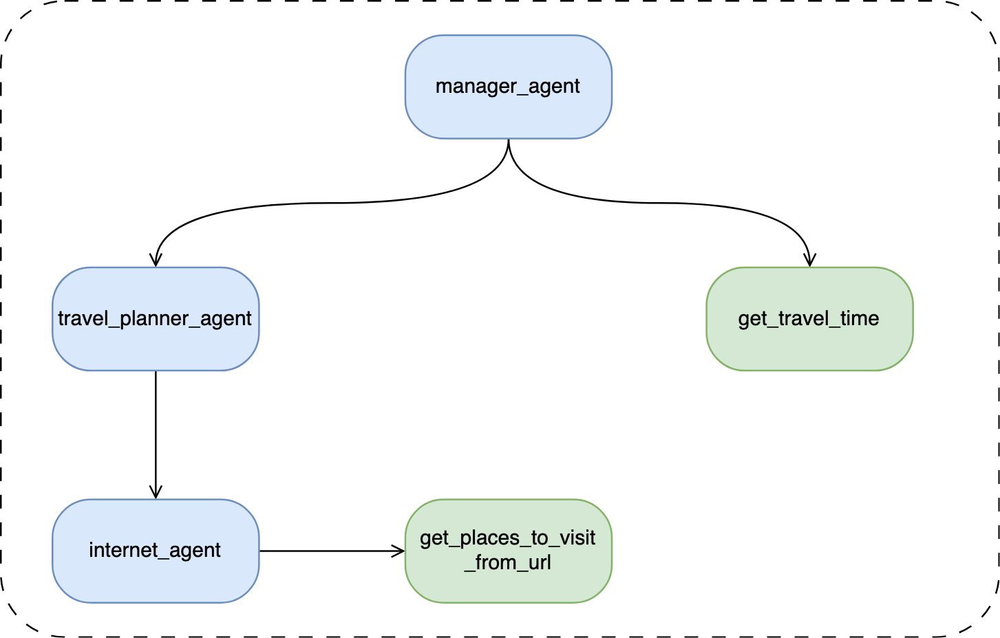

<div align="center">

# 🍕 DataPizza AI


**The Ultimate Framework for Production-Ready AI Applications**

*Build reliable GenAI solutions without the overhead*

[](https://opensource.org/licenses/MIT)
[](https://pypi.org/project/datapizza-ai/)
[](https://www.python.org/downloads/)
[](https://pypi.org/project/datapizza-ai/)
[](https://github.com/datapizza-labs/datapizza-ai)

[🚀 Quick Start](#-quick-start) • [📖 Documentation](https://docs.datapizza.tech) • [🎯 Examples](#-examples) • [🤝 Community](#-community)

</div>

---

## 🌟 Why DataPizza AI?

DataPizza AI transforms the way you build AI applications. No more wrestling with complex integrations, debugging mysterious failures, or spending weeks on boilerplate code.

<div align="center">

### ⚡ **40% Less Debugging** | 🚀 **10x Faster Development** | 🔧 **Production-Ready**

</div>

```python
# This is all you need for a production RAG system
from datapizza.agents import Agent
from datapizza.clients.openai import OpenAIClient

agent = Agent(name="my_agent", client=OpenAIClient(api_key="YOUR_API_KEY"))
result = agent.run("What's the latest in AI research?")
print(result.text)
```

## ✨ Key Features

<table>
<tr>
<td width="50%">

### 🎯 **Smart Agents**
- **Multi-Provider Support**: OpenAI, Google Gemini, Anthropic, Mistral, Azure
- **Tool Integration**: Built-in web search, document processing, custom tools
- **Memory Management**: Persistent conversations and context awareness
- **Streaming Support**: Real-time responses for better UX

</td>
<td width="50%">

### 🔍 **Advanced RAG**
- **Document Processing**: PDF, DOCX, images with Azure AI & Docling
- **Smart Chunking**: Context-aware text splitting and embedding
- **Vector Stores**: Qdrant integration with more coming soon
- **Reranking**: Cohere and Together AI for precision retrieval

</td>
</tr>
<tr>
<td width="50%">

### 🔧 **Production Ready**
- **End-to-End Tracing**: Track every LLM call with inputs/outputs
- **Caching Layer**: Redis integration for performance optimization
- **Pipeline Architecture**: DAG-based workflows for complex use cases
- **Type Safety**: Full TypeScript-style typing for Python

</td>
<td width="50%">

### 🚀 **Developer Experience**
- **Minimal Boilerplate**: Focus on logic, not plumbing
- **Clear Interfaces**: Predictable APIs across all components
- **Rich Ecosystem**: Modular design with optional components
- **Comprehensive Docs**: Examples, guides, and API references

</td>
</tr>
</table>

## 🚀 Quick Start

### Installation

```bash
# Core framework
pip install datapizza-ai

# With specific providers (optional)
pip install datapizza-ai-clients-openai
pip install datapizza-ai-clients-google
pip install datapizza-ai-clients-anthropic
```

### 30-Second Agent

```python
from datapizza.agents import Agent
from datapizza.clients.openai import OpenAIClient

# Create an intelligent agent
client = OpenAIClient(api_key="YOUR_API_KEY")
agent = Agent(name="assistant", client=client)

# Start chatting
response = agent.run("Explain quantum computing in simple terms")
print(response.text)
```

### 2-Minute RAG System

```python
from datapizza.core.vectorstore import VectorConfig
from datapizza.embedders import ChunkEmbedder
from datapizza.embedders.openai import OpenAIEmbedder
from datapizza.modules.parsers.docling import DoclingParser
from datapizza.modules.splitters import NodeSplitter
from datapizza.pipeline import IngestionPipeline
from datapizza.vectorstores.qdrant import QdrantVectorstore

# Set up your RAG pipeline
vectorstore = QdrantVectorstore(location=":memory:")
embedder = ChunkEmbedder(client=OpenAIEmbedder(api_key="YOUR_API_KEY", model_name="text-embedding-3-small"))
vectorstore.create_collection("my_documents",vector_config=[VectorConfig(name="embedding", dimensions=1536)])

pipeline = IngestionPipeline(
    modules=[
        DoclingParser(),
        NodeSplitter(max_char=1024),
        embedder,
    ],
    vector_store=vectorstore,
    collection_name="my_documents"
)

pipeline.run("sample.pdf")

results = vectorstore.search(query_vector = [0.0] * 1536, collection_name="my_documents", k=5)
print(results)
```

## 🎯 Examples

<details>
<summary><b>🔍 Advanced RAG with Reranking</b></summary>

```python
from datapizza.agents import Agent
from datapizza.clients import OpenAIClient
from datapizza.modules.rerankers.cohere import CohereReranker
from datapizza.pipeline import DagPipeline

# Create a sophisticated RAG agent
client = OpenAIClient(api_key="your-key")
reranker = CohereReranker(api_key="cohere-key")

rag_pipeline = DagPipeline()
rag_pipeline.add_node("retrieve", retriever)
rag_pipeline.add_node("rerank", reranker)
rag_pipeline.add_node("generate", client)

agent = Agent(
    name="rag_expert",
    client=client,
    pipeline=rag_pipeline
)

result = agent.run("Compare renewable energy policies across countries")
```

</details>

<details>
<summary><b>🌐 Web-Enhanced Agent</b></summary>

`pip install datapizza-ai-tools-duckduckgo`


```python
from datapizza.agents import Agent
from datapizza.clients.openai import OpenAIClient
from datapizza.tools.duckduckgo import DuckDuckGoSearchTool

client = OpenAIClient(api_key="YOUR_API_KEY")

agent = Agent(
    name="web_researcher",
    client=client,
    tools=[DuckDuckGoSearchTool()]
)

result = agent.run("Who are the founders of Datapizza?")
print(result.text)
```

</details>

<details>
<summary><b>📊 Multi-Modal Document Processing</b></summary>

```python
from datapizza.modules.parsers.azure import AzureParser
from datapizza.modules.captioners import LLMCaptioner
from datapizza.pipeline import IngestionPipeline

# Process documents with images and tables
parser = AzureParser(
    api_key="azure-key",
    endpoint="your-endpoint"
)
captioner = LLMCaptioner(client=OpenAIClient(api_key="openai-key"))

pipeline = IngestionPipeline(
    components=[parser, captioner, embedder],
    vectorstore=vectorstore
)

# Handles PDFs with complex layouts, images, and tables
pipeline.process("complex_research_paper.pdf")
```

</details>

## 🏗️ Architecture

<div align="center">

</div>

DataPizza AI follows a modular, pipeline-based architecture:

- **🧠 Agents**: Orchestrate complex workflows with memory and tools
- **🔌 Clients**: Unified interface for all AI providers
- **⚙️ Modules**: Composable components for document processing
- **🔄 Pipelines**: DAG-based execution for complex workflows
- **📊 Observability**: Built-in tracing and monitoring

## 🌐 Ecosystem

### 🤖 Supported AI Providers

<table>
<tr>
<td align="center"><br><b>OpenAI</b></td>
<td align="center"><br><b>Google Gemini</b></td>
<td align="center"><br><b>Anthropic</b></td>
<td align="center"><br><b>Mistral</b></td>
<td align="center"><br><b>Azure OpenAI</b></td>
</tr>
</table>

### 🔧 Tools & Integrations

| Category | Components |
|----------|------------|
| **📄 Document Parsers** | Azure AI Document Intelligence, Docling, Unstructured |
| **🔍 Vector Stores** | Qdrant (more coming soon) |
| **🎯 Rerankers** | Cohere, Together AI |
| **🌐 Tools** | DuckDuckGo Search, Custom Tools |
| **💾 Caching** | Redis |
| **📊 Embedders** | OpenAI, Google, Cohere, FastEmbed |

## 📈 Performance

<div align="center">

| Metric | DataPizza AI | Traditional Approach |
|--------|--------------|---------------------|
| **Development Time** | 2-3 days | 2-3 weeks |
| **Lines of Code** | 50-100 | 500-1000 |
| **Debugging Time** | 40% less | Baseline |
| **Production Issues** | Minimal | Frequent |

</div>

## 🎓 Learning Resources

- 📖 **[Complete Documentation](https://docs.datapizza.tech)** - Comprehensive guides and API reference
- 🚀 **[Quick Start Guide](https://docs.datapizza.tech/guides/quick-start)** - Get up and running in minutes
- 🏗️ **[Architecture Guide](https://docs.datapizza.tech/guides/architecture)** - Understanding the framework
- 🎯 **[RAG Tutorial](https://docs.datapizza.tech/guides/rag)** - Build production RAG systems
- 🤖 **[Agent Examples](https://docs.datapizza.tech/examples/agents)** - Real-world agent implementations

## 🤝 Community


- 💬 **[Discord Community](https://discord.gg/s5sJNHz2C8)** 
- 📚 **[Documentation](https://docs.datapizza.tech)** 
- 📧 **[GitHub Issues](https://github.com/datapizza-labs/datapizza-ai/issues)** 
- 🐦 **[Twitter](https://x.com/datapizza_ai)** 

### 🌟 Contributing

We love contributions! Whether it's:

- 🐛 **Bug Reports** - Help us improve
- 💡 **Feature Requests** - Share your ideas  
- 📝 **Documentation** - Make it better for everyone
- 🔧 **Code Contributions** - Build the future together

Check out our [Contributing Guide](CONTRIBUTING.md) to get started.

## 📄 License

This project is licensed under the MIT License - see the [LICENSE](LICENSE) file for details.

---

<div align="center">

**Made with ❤️ by the DataPizza Team**

*Building the future of AI, one slice at a time* 🍕

[⭐ Star us on GitHub](https://github.com/datapizza-labs/datapizza-ai) • [🚀 Get Started](https://docs.datapizza.tech) • [💬 Join Discord](https://discord.gg/s5sJNHz2C8)

</div>